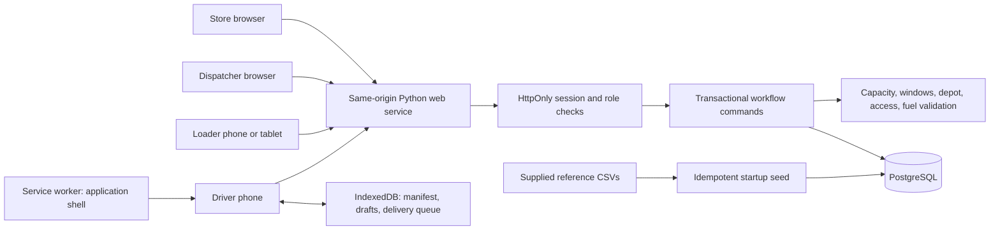

# Architecture

The frontend uses the Day 5 HTML/CSS identity and plain JavaScript. Assets and API share one origin: no cross-origin cookies are required. Vercel's Python Function adapter reuses the same API handler and domain commands as the Docker web service. PostgreSQL through the Vercel Marketplace is the public deployment database. Serverless mode refuses ephemeral SQLite. SQLite remains a dependency-free local development/test adapter using the same SQL schema. A managed TLS proxy fronts public deployments.

Every mutation runs in a transaction. PostgreSQL advisory transaction locks serialize mutations across service replicas; SQLite uses an immediate transaction and a process lock. Draft runs also carry a version so stale browser edits return a conflict. This is intentionally conservative for a 60-vehicle competition workload; it trades peak write throughput for easy-to-audit allocation consistency.

The server hashes passwords with salted PBKDF2-HMAC-SHA256, stores only session-token hashes, and checks session expiration. Roles, outlet ownership, trip assignment, manifest state, and record transitions are validated independently of the UI. POST requests require a custom same-origin header; cross-origin requests are rejected and no CORS policy is enabled. Evidence is limited to validated raster data URLs, displayed under a restricted content security policy. Sensitive data is not cached by the service worker or exposed through static paths.

The service worker caches only application assets. IndexedDB stores each user's last workspace, local delivery drafts, and immutable queued handover payloads. Records are saved locally before network upload and removed only after acknowledgment. A lost response followed by a retry returns the original acknowledged result using the client ID and payload hash. Conflicting handovers remain queued with an actionable error, requiring dispatcher review; the application does not silently overwrite server records.

Server snapshots refresh every 15 seconds when forms have no unsaved edits. Offline driver work uses cached assignments; synchronization checks current server authority again. Offline cache access is device-local and is not proof of authentication. Expired sessions require signing back in as the assigned driver before uploading records.

Operational scope: four roles, synthetic accounts, two depots, 120 outlets, 60 vehicles, one realistic seeded day, multiple validated runs. No live traffic, GPS, unsolicited notifications, or Datathon prediction models are claimed.
