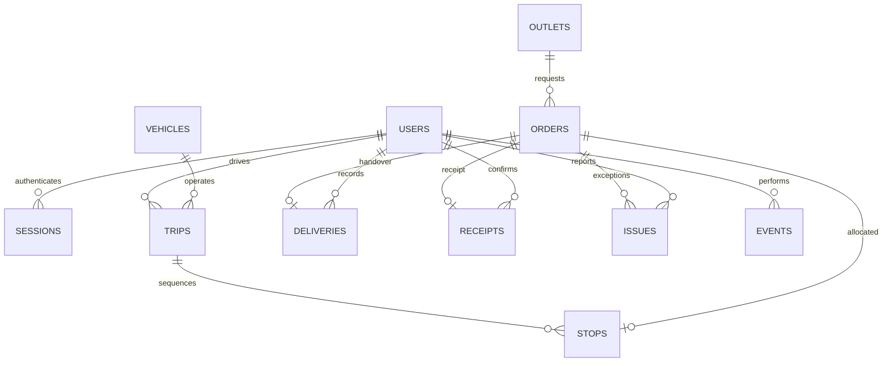

# Data model

| Table | Purpose and integrity |
|---|---|
| `users` | Four judge accounts plus one driver per remaining fleet vehicle; salted password hashes, store outlet, loader depot, and driver vehicle scope. |
| `sessions` | Hashed opaque cookie token, user foreign key, UTC expiration. |
| `outlets`, `vehicles` | Reference IDs and complete original CSV row JSON; operational records reference their IDs. |
| `calendar` | Original operating-day/calendar attributes, keyed by ISO date. |
| `orders` | Outlet, unit count, weight, volume, temperature, original/current delivery date, status, deferral reason/count. Positive quantities are constrained. |
| `trips` | Vehicle, assigned driver, date, departure, state, optimistic version, published fuel/distance/return reservation. |
| `stops` | One allocation per order, trip foreign key, explicit sequence, physical loaded quantity, verification, published ETA, recorded arrival. |
| `deliveries` | One immutable handover per order; unique client ID, payload hash, quantity, recipient, exception, evidence, recorded/synced UTC timestamps. |
| `receipts` | Separate store checkpoint: one record per order, actual received count, explanation, confirmation timestamp. |
| `issues` | Loading, delivery, and receipt exceptions with original report and explicit resolution. |
| `events` | Persistent actor/entity/action audit history. |

All timestamps are UTC in the database, displayed in Asia/Colombo. Dates/times in route plans are SLT. Published fuel reservations count toward the vehicle's ISO week; completed runs retain their reservation. Orders are indivisible handling requests. Deferred orders keep the original delivery date and advance to the next operating date. Resolving a discrepancy does not erase the actual delivery or receipt quantities.

The `stops.order_id` primary key prevents double allocation. Delivery and receipt primary keys prevent duplicate checkpoints. The delivery client ID and payload hash distinguish safe retries from conflicting records. Atomic publication prevents concurrent runs from exceeding the vehicle's fuel/daily route allowance.

The full portable schema is in `backend/db.py`; SQLite development and PostgreSQL deployments share it. CSV row attributes remain faithful to the supplied records; service allowance and district travel tables are read-only calculation inputs under `data/`.
